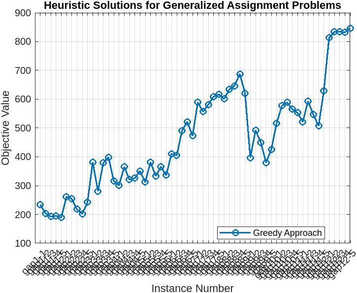
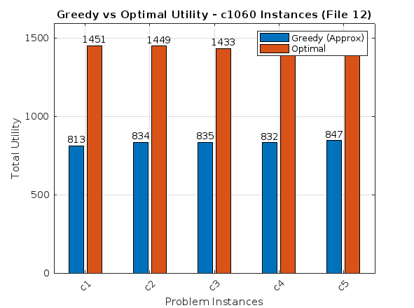

# Generalized Assignment Problem (GAP) - Approximation

This project explores the **Generalized Assignment Problem (GAP)** and implements a **greedy approximation algorithm** to solve it. The results are compared against optimal solutions to evaluate the effectiveness of the heuristic approach.

## 📌 Problem Overview

The Generalized Assignment Problem is a well-known NP-hard combinatorial optimization problem where tasks must be assigned to agents such that the total benefit is maximized without violating resource constraints.

## 🛠️ Approach

- **Heuristic (Greedy) Algorithm:** Implemented in `tryapprox.m`, this method uses a simple strategy to assign tasks to agents by selecting the feasible assignment with the lowest cost.
- **Comparison with Optimal:** The script `compareApproxAndOptimal.m` compares the greedy solution values with the optimal values obtained from another solver.

## 📊 Visualizations

### 1. Greedy Approximation Results Across GAP Instances

### 2. Greedy vs Optimal Utility for File 12 Instances

These plots show the behavior of the greedy algorithm and how it performs in comparison to the optimal utility.

## 📁 Files Description

- `tryapprox.m`: Script to solve GAP instances using the greedy approximation method.
- `compareApproxAndOptimal.m`: Script to compare greedy and optimal results and generate a performance plot.
- `gap_greedy_results.csv`: Output CSV file containing solution values from the greedy algorithm.
- `gap_max_results.csv`: CSV file containing optimal values (not included here but expected).
- `Approx.png`: Visualization of greedy solution across different GAP instances.
- `optimalVSapprox.png`: Comparison bar chart between greedy and optimal values for selected instances.

## ✅ Results Summary

- The greedy algorithm offers a fast and simple solution to GAP.
- Performance is consistently lower than the optimal but acceptable in many cases.
- Provides a useful baseline when exact solutions are computationally expensive.

---

**Note:** For full reproducibility, place GAP dataset files under `./gap dataset files/` as expected by the scripts.

